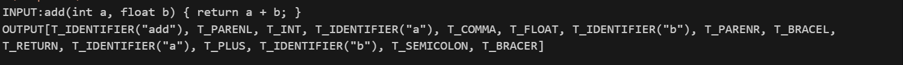
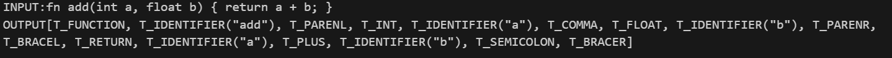

# Simple Lexer

A basic lexical analyzer that converts code into tokens.

## What it does
- Takes code like: `fn add(int a) { return a + 1; }`
- Splits it into tokens: `fn`, `add`, `(`, `int`, `a`, `)`, `{`, `return`, `a`, `+`, `1`, `;`, `}`
- Identifies what each token is: function, identifier, parenthesis, etc.

## How to use
1. Compile: `g++ -o lexer source.cpp`
2. Run: `./lexer`

## Files
- `lexer1.cpp` - The main lexer code
- `string_queue.hpp` - Stores the tokens
- `source.cpp` - Test program
- `Makefile` - Easy build commands

## What it recognizes
- Keywords: fn, return, if, while, int, float
- Operators: +, -, *, /, =, ==, >, <
- Symbols: (, ), {, }, ;, ,
- Numbers: 42, 3.14
- Names: variable names

## PARSER RESULT
     